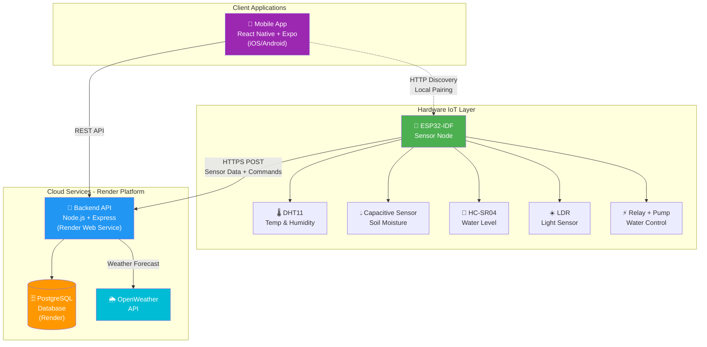

# Arquitectura del Sistema AgroMind

## Diagrama de Arquitectura



## Descripción de Componentes

### Hardware IoT Layer

**ESP32-IDF Sensor Node**
- Microcontrolador ESP32 con framework ESP-IDF
- Servidor HTTP local (puerto 80) para pairing con la app
- Almacenamiento NVS para configuración persistente
- Conexión HTTPS segura con el backend
- Auto-pairing y descubrimiento desde la app móvil

**Sensores:**
- **DHT11**: Temperatura y humedad ambiental
- **Sensor Capacitivo**: Humedad del suelo (0-100%)
- **HC-SR04**: Nivel de agua del tanque vía ultrasonido
- **LDR**: Nivel de luz ambiental

**Actuadores:**
- **Relé**: Control de bomba de agua (active-low)

### Cloud Services

**Backend API (Render)**
- Runtime: Node.js 18 + Express
- Base de datos: PostgreSQL en Render
- Endpoints REST para:
  - Autenticación de usuarios
  - Gestión de zonas
  - Recepción de datos de sensores
  - Control de dispositivos IoT
  - Integración con OpenWeather API

**PostgreSQL Database**
- Almacenamiento de:
  - Usuarios y autenticación
  - Zonas y configuraciones
  - Histórico de sensores
  - Configuración de riego automático

**OpenWeather API**
- Pronóstico del clima por zona
- Decisión inteligente de riego basada en lluvia

### Client Applications

**Mobile App (React Native + Expo)**
- Multiplataforma: iOS y Android
- Navegación con Expo Router
- Características:
  - Autenticación de usuarios
  - Gestión multi-zona
  - Dashboard en tiempo real
  - Configuración de riego automático
  - Pairing local con ESP32
  - Tema claro/oscuro

## Flujo de Datos

### 1. Datos de Sensores (ESP32 → Backend)

```
ESP32 lee sensores cada 10s
    ↓
POST /api/iot/sensor-data
    ↓
Backend actualiza DB
    ↓
Backend responde con comandos
    ↓
ESP32 ejecuta comandos
```

**Payload de ejemplo:**
```json
{
  "zoneId": 1,
  "sensors": {
    "temperature": 25.3,
    "ambientHumidity": 65.0,
    "soilMoisture": 45.2,
    "waterLevel": 78.5,
    "lightLevel": 62.0,
    "pumpStatus": false
  }
}
```

### 2. Comandos de Control (Backend → ESP32)

**Respuesta del servidor:**
```json
{
  "success": true,
  "commands": {
    "autoMode": true,
    "moistureThreshold": 30,
    "wateringDuration": 10,
    "tankLocked": false,
    "pumpState": null
  }
}
```

### 3. Pairing Local (App ↔ ESP32)

```
App escanea red local
    ↓
GET http://{esp32-ip}/info
    ↓
ESP32 responde con estado y MAC
    ↓
Usuario confirma pairing
    ↓
POST http://{esp32-ip}/pair
Body: { "zoneId": 123 }
    ↓
ESP32 guarda zoneId en NVS
    ↓
ESP32 comienza a enviar datos
```

## Seguridad

### Credenciales
- **Backend**: Variables de entorno en Render
- **Mobile**: Variables de entorno en `.env`
- **ESP32**: Archivo `config.h` (no versionado)

### Comunicación
- **ESP32 → Backend**: HTTPS con bundle de certificados
- **Mobile → Backend**: HTTPS
- **Mobile ↔ ESP32**: HTTP local (red privada)

## Tecnologías

| Componente | Tecnología | Versión |
|------------|------------|---------|
| Backend | Node.js + Express | 18.x |
| Database | PostgreSQL | 15 |
| Mobile | React Native + Expo | Latest |
| ESP32 | ESP-IDF | 5.x |
| Deployment | Render | Cloud |
| Weather API | OpenWeatherMap | 2.5 |

## Escalabilidad

- ✅ Multi-usuario: Cada usuario tiene sus propias zonas
- ✅ Multi-zona: Un usuario puede tener múltiples ESP32
- ✅ Multi-región: Cada zona puede estar en diferente ubicación geográfica
- ✅ Failover: Backend en la nube con alta disponibilidad

## Monitoreo

- Logs de backend en Render Dashboard
- Monitor serial del ESP32 vía Puerto USB
- Logs de la app móvil vía Expo Dev Tools
